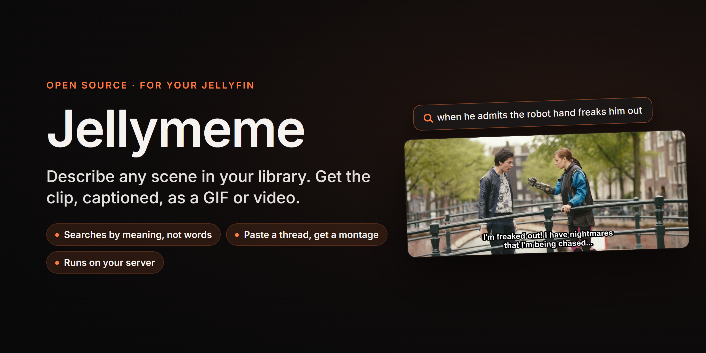
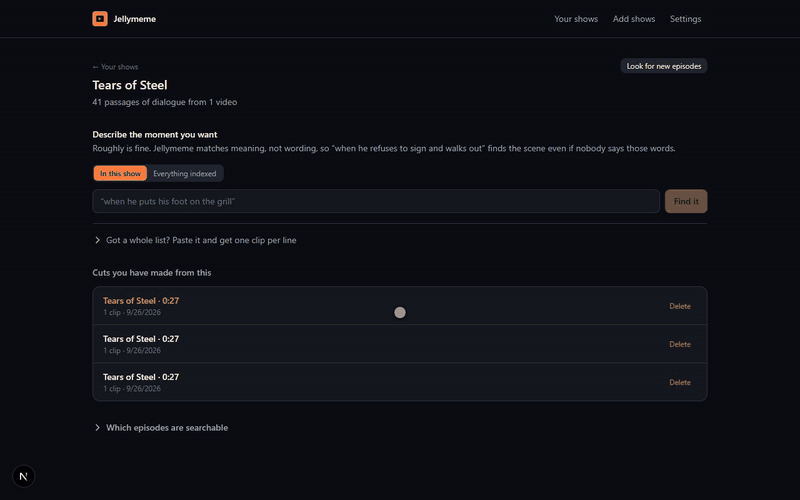

<p align="center">
  
</p>

**Remember a scene but not where it is?** Describe it the way you'd tell a friend, "when he
admits the robot hand freaks him out", and Jellymeme finds it in your Jellyfin library,
trims it to the line you want, burns in the subtitles or your own caption, and hands you a
GIF, a clip or a still.

<p align="center">
  
  <br><sub>Made by Jellymeme from one sentence. <i>Tears of Steel</i> © Blender Foundation, <a href="https://creativecommons.org/licenses/by/3.0/">CC BY 3.0</a>.</sub>
</p>

<p align="center">
  
</p>

Two ways in:

- **One scene.** Describe a single moment — "when he sets his foot on the grill" — pick it from the
  results, trim it exactly, caption it, and export a GIF, a clip, or a still image. When one query
  answers more than once — every "never seen it" in the show — tick as many results as you want and
  they become the clips of one cut.
- **A whole montage.** Paste a wall of text — the replies from a "best scenes in this show" thread,
  a list you wrote yourself, whatever shape it arrives in — and every line becomes a clip, matched,
  ordered and editable.

Either way you land in the same editor: nudge the in and out points, swap a match it got wrong,
burn in captions, export.

It talks to Jellyfin over its HTTP API and **never needs access to your media files**.

---

## How it works

```
Jellyfin  ──subtitles──▶  parse → window → embed  ──▶  SQLite + sqlite-vec
   │                                                          │
   │                          paste ──▶ split ──▶ embed ──▶ KNN search
   │                                                          │
   └──media over HTTP range──▶  ffmpeg: clip → caption → concat → MP4/GIF
```

**Indexing.** For each episode, Jellyfin is asked for its subtitle track as SRT. It transcodes
ASS/SSA and embedded MKV tracks server-side, so Jellymeme never runs ffmpeg to extract subtitles.
Cues are cleaned (speaker labels, sound effects, markup) and grouped into *overlapping dialogue
windows* — a single cue like "No." carries no meaning, and a described scene spans several lines.
Each window is embedded locally with `all-MiniLM-L6-v2` via transformers.js and stored in
`sqlite-vec` alongside the text.

**Matching.** Pasted text is split into descriptions, embedded, and searched with KNN scoped to the
selected title. Because windows overlap, a naive top-k returns five views of the same ten seconds —
so results are de-duplicated by time to yield genuinely distinct moments. That's what makes "try
another match" show you something new.

**Rendering.** ffmpeg reads each clip directly from Jellyfin's static stream endpoint using HTTP
range requests, seeking straight to the timestamp rather than downloading the file. Each segment is
normalised to identical parameters so they can be concatenated with a stream copy, and captions are
burned with libass.

### Why not a Jellyfin plugin?

A plugin lives inside your Jellyfin install and can never be shared with anyone who isn't on your
server. Running as a sidecar keeps that door open, and keeps the ML and video work out of a .NET
plugin sandbox that was never built for it.

### Jellyfin does the parts it's good at

| Job | Who does it | Why |
| --- | --- | --- |
| Library, metadata, episode lists | Jellyfin | It already scanned and organised everything |
| Subtitle extraction and format conversion | Jellyfin | `Stream.srt` converts any text track server-side |
| Preview playback in the browser | Jellyfin transcoder | Chrome won't decode most library MKV/HEVC |
| Frame-accurate clip export | ffmpeg | Jellyfin's stream endpoint has `startTimeTicks` but no end |
| Still frames and GIF palettes | ffmpeg | Not something a media server exposes |
| Semantic search | Jellymeme | Jellyfin only does substring title search |

---

## Requirements

- **Jellyfin 10.9+** (developed and verified against 10.11.7) with an API key
- **Node.js 20+**
- A **text-based subtitle track** on the content you want to index — SRT, ASS/SSA, or embedded
  MKV subs. Bitmap subtitles (PGS, VOBSUB) are image-based and are skipped; the UI reports exactly
  which episodes were skipped and why.
- ffmpeg is **not** required system-wide — a static binary ships via `ffmpeg-static`.
- A font must be available for burned captions. Most systems have one; see
  `JELLYMEME_CAPTION_FONT` below.

## Getting started

```bash
npm install
npm run dev
```

Open <http://localhost:3000>, go to **Settings**, and enter your Jellyfin URL and an API key
(Jellyfin → Dashboard → Advanced → API Keys). The key is stored in the local SQLite database and is
never sent to the browser — artwork, previews and media all proxy through the server.

Then:

1. **Search** for a show or film and click **Index**. Indexing is resumable; each episode commits as
   it finishes.
2. Open the title. Pick **One scene** to describe a single moment and choose from the results — tick
   several results instead to cut them all together — or **Whole montage** to paste a list where
   every line becomes a clip.
3. **Edit**: adjust each clip's start and end in either direction, cycle alternate matches, search
   manually for the ones that landed wrong, caption the cut and then any clip that wants its own,
   size and place the text, rewrite individual subtitle lines, mute clips.
4. **Export** as MP4, GIF, WebM, or a single frame as PNG or JPG.

### Trimming

Each edge of a clip moves both ways. Positive extends the clip outward, negative pulls it inward —
a matched dialogue window is often longer than the moment you actually want, so tightening matters
as much as padding. Drag the slider, nudge with the ± buttons, or use the arrow keys for 250 ms
steps.

### Captions

Three modes: none, the **real subtitles** for that moment (re-fetched from Jellyfin at render time
with their original timings), or your own **custom text** in meme style — uppercase, white with a
heavy outline, top-centre. Captions are burned with libass, so they wrap properly and appear
identically in a still and in the video of the same moment.

Set the mode once for the whole cut; any clip can then be given its own instead.

**Size and placement.** A slider from 50% to 300% of the default type size, and a choice of top,
bottom, or wherever the mode normally puts it. The size is a multiplier rather than a point size, so
captions stay the same relative size whether you export at 320px or 1080px. Set for the cut, and
overridable per clip — a clip can be made larger while still following the cut's words.

**Editing the real subtitles.** With subtitles on, each clip lists the lines that fall inside it and
every one can be rewritten. The timings stay the show's, so a changed word still lands on the frame
where it was spoken — change one name across three clips, drop a line by emptying it, and leave the
rest of the dialogue as recorded. Edits belong to the clip and survive switching caption modes back
and forth. Re-indexing the title can move its cue timings, which is the one thing that will orphan
an edit; the original line comes back if it does.

### Still images

Choose PNG or JPG and a frame picker appears. The frame is grabbed from the finished cut, so any
burned caption is baked in exactly as it appears in the video.

## Configuration

All optional.

| Variable | Default | Purpose |
| --- | --- | --- |
| `JELLYMEME_DATA` | `./data` | SQLite database and cached model weights |
| `JELLYMEME_RENDERS` | `./renders` | Finished exports |
| `JELLYMEME_MODEL_CACHE` | `$JELLYMEME_DATA/models` | Embedding model weights (~90 MB, downloaded once) |
| `JELLYMEME_CAPTION_FONT` | `DejaVu Sans` | Font family for burned captions |
| `JELLYFIN_URL` / `JELLYFIN_API_KEY` | — | Pre-seed the connection instead of using the UI |

## Docker

```bash
docker compose up -d
```

`docker-compose.yml` runs Jellymeme alongside an existing Jellyfin. It needs no volume mounts for
your media — only a volume for its own database and renders.

## Performance

On four CPU cores, embedding runs at roughly 600 passages/second. A 22-minute episode produces
~200 dialogue windows, so a 200-episode series indexes in about a minute of embedding plus however
long Jellyfin takes to serve the subtitles. No GPU required.

Rendering is dominated by ffmpeg encode time. A ten-clip montage at 720p takes a few seconds; the
clips are read over HTTP but only the bytes around each timestamp are transferred.

## Testing

```bash
npm test                      # unit tests: parsing, windowing, paste splitting
RUN_FFMPEG_TESTS=1 npm test   # adds the real ffmpeg pipeline and a full end-to-end run
```

The end-to-end suite stands up a mock Jellyfin server implementing endpoint shapes verified against a
real 10.11.7 install, then indexes, searches, builds a montage and renders it — every layer except
Jellyfin itself runs for real. The mock's limits, and which assertions they weaken, are in
[docs/ARCHITECTURE.md](docs/ARCHITECTURE.md).

## Known limitations

- **Dialogue only.** Search matches what characters *say*. A wordless visual gag or a reaction shot
  with no line cannot be found. Visual search would need frame embeddings (CLIP) and a GPU; the
  schema and pipeline are shaped so that could be added alongside rather than replacing this.
- **No transcription.** Content without a text subtitle track is skipped rather than transcribed.
  Adding Whisper for the gaps is the natural next step if your library has holes.
- **Single user.** There is no authentication. Don't expose it to the internet as-is.
- Seven `npm audit` advisories, all high, all transitive: Next.js and its own tree (`next`,
  `postcss`, `sharp`, `nanoid`) and transformers.js (`onnxruntime-node` → `adm-zip`). They cannot be
  resolved without forcing breaking upgrades, and `onnxruntime-node` is deliberately pinned below
  1.24 for a crash reason described in `docs/ARCHITECTURE.md`.

## Legal

**Bring your own library.** Jellymeme searches and cuts media you already have on your own
Jellyfin server. It does not download, host, index or distribute anything, and nothing it
reads leaves your machine except requests to your own Jellyfin server.

**What you export is yours to answer for.** A clip or a still is still part of someone
else's film or show. Short excerpts for commentary, criticism or parody may be fair use (US)
or fair dealing (UK, Canada and others), but that depends on the use and the jurisdiction and
is not something this software can decide for you. Share what you have the right to share.
This is not legal advice.

**Not affiliated with Jellyfin.** Jellymeme talks to Jellyfin's public HTTP API. It is not
made, endorsed or supported by the Jellyfin project, and does not use the Jellyfin logo.

**Third-party components**

| Component | Licence | How it arrives |
|---|---|---|
| [FFmpeg](https://ffmpeg.org/legal.html) | LGPL-2.1+ / GPL-2.0+ depending on build | Debian package in the Docker image; `ffmpeg-static` (GPL-3.0-or-later) for local dev |
| [all-MiniLM-L6-v2](https://huggingface.co/sentence-transformers/all-MiniLM-L6-v2) | Apache-2.0 | downloaded on first run, not in this repo |
| [transformers.js](https://github.com/huggingface/transformers.js) | Apache-2.0 | npm |
| [sqlite-vec](https://github.com/asg017/sqlite-vec) | MIT / Apache-2.0 | npm |
| [better-sqlite3](https://github.com/WiseLibs/better-sqlite3), [Next.js](https://github.com/vercel/next.js), React | MIT | npm |

**Media in this README** comes from the Blender Foundation open movie
[*Tears of Steel*](https://mango.blender.org/), © Blender Foundation,
[CC BY 3.0](https://creativecommons.org/licenses/by/3.0/), run through Jellymeme unmodified
apart from the trim and the burned-in official subtitles.

**Test fixtures.** The two comment threads under `src/lib/montage/*.fixture.txt` keep a real
Reddit thread's layout — usernames, timestamps, vote counts, ads, reply buttons — because the
parser has to survive it, but every name and comment in them is invented.

## Licence

GNU AGPL v3, see [LICENSE](LICENSE).
